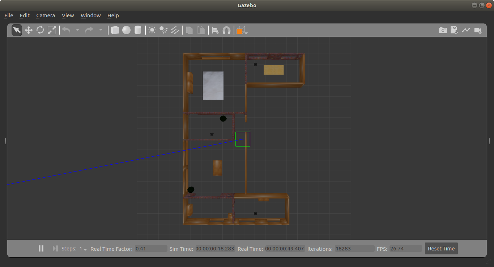
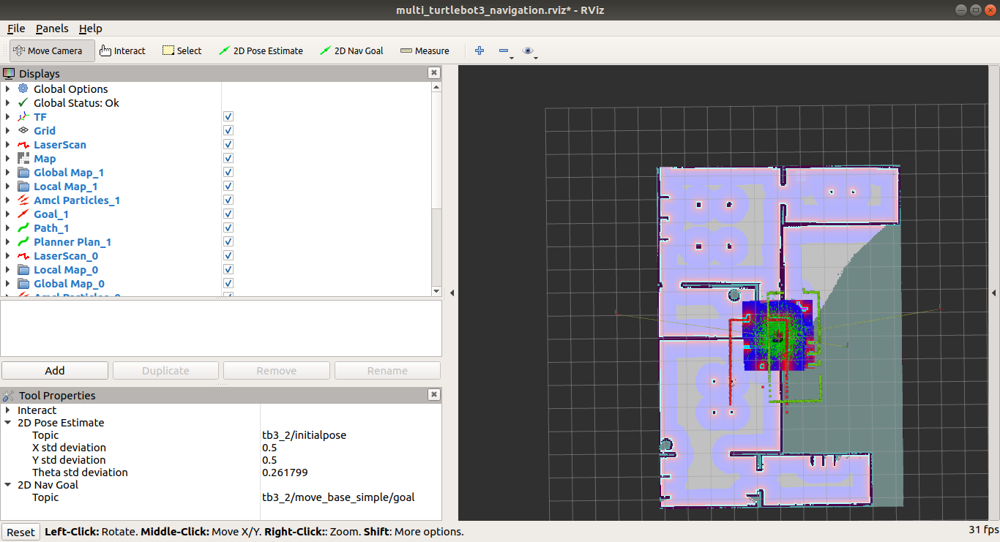
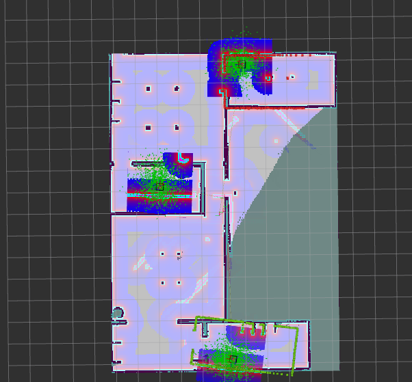
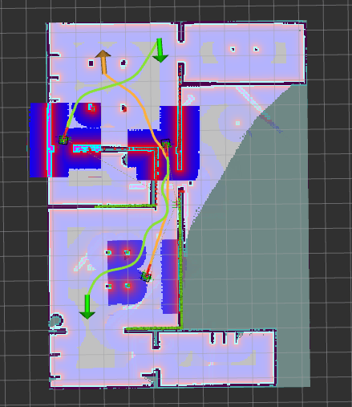

# Multiple TurtleBot3 Navigation Environment
Literally as title, this package provides launch files allowing turtlebots to navigate in "the house". 


## Installation
1. Install ROS. (Hey Google, what is ROS?)
2. Clone all relative packages into <your_ws>/src/.
```
source /opt/ros/melodic/setup.bash
cd catkin_ws
wget https://gist.githubusercontent.com/airuchen/db3ee4f57b0f4ce97affac5beb5065d3/raw/a7542b5c9d640c3161673619e86eac23722c8ec9/multiple_turtlebot3_env.repos
vcs import src/ < multiple_turtlebot3_env.repos
catkin_make
source devel/setup.bash
```

## Usage 
1. First terminal -- Launch the simulation

* Source setup file.
```
source /opt/ros/melodic/setup.bash
source <your_ws>/devel/setup.bash
export TURTLEBOT3_MODEL=waffle_pi
```
* Launch multiple turtlebot3 in Gazebo simulation.
```
roslaunch turtlebot3_gazebo multi_turtlebot3.launch
```
There, there, you'll see the Gazebo window showing house model and three turtlebot3 -- tb3_0, tb3_1, tb3_2

***To save the usage of your CPU usage, killall gzclient can close the GUI, which consumes lots of resource.***

2. Second terminal -- Launch navigation stacks
* Source setup file.
```
source /opt/ros/melodic/setup.bash
source <your_ws>/devel/setup.bash
```
* Launch Navigation for three turtlebot3.
```
roslaunch turtlebot3_navigation multi_nav_bringup.launch
```
Rviz shows up.


By changing topics in Tool properties, set Pose estimation of each bot.


After setting each of their pose, Rviz would be like this.


Now, the way to set goal is identical with how you set the pose estimation. Try to give each robot a different goal. 


## Control with Behavior Tree
```
rosrun tb_sample node _file:=/home/<user>/catkin_ws/src/BT_ros1/BT_sample/cfg/multi_bt.xml
```
The behavior tree will set goal to each robot. [See the DEMO](https://www.youtube.com/watch?v=hilXQiEUrk8)
